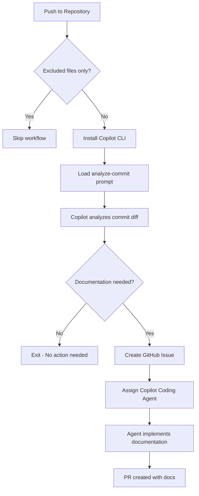

# Generate Documentation Workflow

**Workflow File**: [`.github/workflows/generate-docs.yml`](../../.github/workflows/copilot.generate-docs.yml)

## Overview

The Generate Documentation workflow leverages GitHub Copilot CLI to analyze code changes and automatically creates documentation when necessary. Instead of relying on developers to remember to update docs, this agentic workflow handles it autonomously.


## How It Works



### Step-by-Step Process

1. **Triggers on every push** (excluding docs and markdown files)
2. **Installs Copilot CLI** in the GitHub Actions runner
3. **Loads the analyze-for-docs prompt** from [`.github/prompts/analyze-for-docs.prompt.md`](../../.github/prompts/analyze-for-docs.prompt.md)
4. **Copilot examines the commit diff** using MCP tools
5. **If documentation is needed** → Creates a GitHub issue and assigns Copilot
6. **Copilot Coding Agent** then implements the documentation


## Criteria for Documentation

### ✅ Documentation IS Needed

| Change Type | Example |
|-------------|---------|
| Public APIs | New REST endpoints, GraphQL mutations |
| Functions/Classes | Exported functions, public class methods |
| Complex Logic | Algorithms, business rules, data transformations |
| Architectural Changes | New services, modified data flow |
| Breaking Changes | API contract changes, removed features |

### ❌ Documentation NOT Needed

| Change Type | Example |
|-------------|---------|
| Minor Refactoring | Variable renames, code reorganization |
| Formatting | Whitespace, linting fixes |
| Trivial Typo Fixes | Comment typos, string corrections |
| Internal Implementation | Private methods, internal helpers |


## Configuration

### Trigger Configuration

The workflow excludes certain paths to avoid unnecessary runs:

```yaml
on:
  push:
    paths-ignore:
      - 'docs/**'
      - '**/*.md'
      - '.github/workflows/**'
```

### Required Secrets & Tokens

The workflow uses a **dual-token authentication pattern** for different purposes:

| Token/Secret | Environment Variable | Description | Permissions Required |
|--------------|---------------------|-------------|---------------------|
| `COPILOT_CLI_TOKEN` | `GH_TOKEN` | Personal Access Token for Copilot CLI authentication | `copilot` scope |
| `GITHUB_TOKEN` (automatic) | `GITHUB_MCP_TOKEN` | Workflow token for MCP GitHub operations | `contents: read`, `issues: write` |

#### Token Usage Breakdown

**`GH_TOKEN` (Copilot CLI Token)**
- Used by: Copilot CLI for API authentication
- Authenticates: Requests to GitHub Copilot API
- Source: Repository secret (`COPILOT_CLI_TOKEN`)
- Required scope: `copilot` (GitHub Copilot API access)

**`GITHUB_MCP_TOKEN` (MCP Operations Token)**
- Used by: MCP server for GitHub operations (via `mcp.json`)
- Authenticates: GitHub API calls (create issues, list repos, read files)
- Source: Automatic workflow token (`secrets.GITHUB_TOKEN`)
- Required permissions: Set in workflow `permissions:` block
  - `contents: read` - Read repository content and commit diffs
  - `issues: write` - Create and manage GitHub issues

---

## MCP (Model Context Protocol) Configuration

### What is MCP?

The **Model Context Protocol (MCP)** is a standard protocol that allows AI models like GitHub Copilot to interact with external tools and services. In this workflow, MCP enables Copilot to:

- 📖 Read repository files and commit diffs
- 🔍 Navigate project structure
- ✍️ Create GitHub issues
- 👤 Assign issues to users (including itself)
- 🏷️ Add labels to issues

### MCP Configuration File

**Location**: [`.github/mcp.json`](../../.github/mcp.json)

```json
{
  "mcpServers": {
    "github": {
      "type": "http",
      "url": "https://api.githubcopilot.com/mcp/",
      "headers": {
        "Authorization": "Bearer ${GITHUB_MCP_TOKEN}"
      }
    }
  }
}
```

#### Configuration Fields

| Field | Value | Description |
|-------|-------|-------------|
| `mcpServers.github.type` | `http` | MCP server type (HTTP-based API) |
| `mcpServers.github.url` | `https://api.githubcopilot.com/mcp/` | GitHub Copilot MCP server endpoint |
| `mcpServers.github.headers.Authorization` | `Bearer ${GITHUB_MCP_TOKEN}` | Authentication header with workflow token |

The `${GITHUB_MCP_TOKEN}` environment variable is automatically substituted by the Copilot CLI at runtime.

### Workflow Configuration

The workflow passes the MCP configuration to Copilot CLI:

```yaml
copilot -p "$PROMPT" \
  --mcp-config .github/mcp.json \
  --allow-all-tools
```

**Flags explained:**
- `--mcp-config .github/mcp.json` - Path to MCP configuration file (replaces deprecated `--enable-all-github-mcp-tools`)
- `--allow-all-tools` - Allow Copilot to use all available MCP tools

---

## Prompt File

The workflow uses a specialized prompt to guide Copilot's analysis:

**Location**: [`.github/prompts/analyze-for-docs.prompt.md`](../../.github/prompts/analyze-for-docs.prompt.md)

This prompt instructs Copilot to:
- Analyze the git diff of the latest commit
- Evaluate changes against documentation criteria
- Determine if public-facing code was added or modified
- Create a well-structured issue if documentation is warranted


## Example Issue Created

When the workflow detects documentation is needed, it creates an issue like:

```markdown
## 📚 Documentation Needed

**Commit**: abc1234
**Author**: @developer

### Changes Requiring Documentation

- New `/api/warehouses` endpoint added
- `Warehouse` model with 10 properties
- CRUD operations for warehouse management

### Suggested Documentation

1. Update API documentation with new endpoints
2. Add Warehouse model to data model docs
3. Include usage examples

/assign @copilot
```


## Troubleshooting

### Workflow Not Triggering

- Verify the push includes files outside the `paths-ignore` patterns
- Check that the workflow file exists in the default branch

### Copilot Not Creating Issues

- Ensure `COPILOT_CLI_TOKEN` secret is configured
- Verify the token has `Copilot Requests` permission
- Check workflow logs for authentication errors

### MCP Authentication Failures

**Problem**: `Error: MCP authentication failed` or `401 Unauthorized`

**Solutions**:
1. Verify workflow has correct permissions:
   ```yaml
   permissions:
     contents: read    # Required to read repository content
     issues: write     # Required to create GitHub issues
   ```
2. Check that `GITHUB_MCP_TOKEN` is set to `${{ secrets.GITHUB_TOKEN }}`
3. Ensure `.github/mcp.json` exists and has correct format
4. Verify MCP server URL is accessible: `https://api.githubcopilot.com/mcp/`

**Problem**: `Error: Cannot find mcp.json` or `Invalid MCP configuration`

**Solutions**:
1. Verify `.github/mcp.json` exists in repository root
2. Validate JSON syntax (no trailing commas, proper quotes)
3. Check file is not in `.gitignore`
4. Ensure `--mcp-config` path is correct: `--mcp-config .github/mcp.json`

**Problem**: `Copilot created issue but couldn't read commit diff`

**Solutions**:
1. Verify `contents: read` permission is granted
2. Check that commit SHA is valid and exists in repository
3. Ensure MCP token has access to private repositories (if applicable)

### Agent Not Implementing Documentation

- Confirm Copilot Coding Agent is enabled in repository settings
- Verify the issue is properly assigned to `@copilot`

---

## Migration from Deprecated Flag

If you're upgrading from an older version of this workflow, note the following change:

**Before** (deprecated):
```yaml
copilot -p "$PROMPT" --enable-all-github-mcp-tools
```

**After** (current):
```yaml
copilot -p "$PROMPT" \
  --mcp-config .github/mcp.json \
  --allow-all-tools
```

The `--enable-all-github-mcp-tools` flag is deprecated. Use `--mcp-config` with a configuration file instead.
