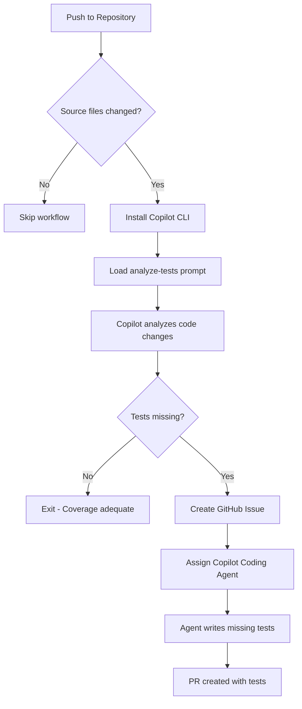

# Generate Tests Workflow

**Workflow File**: [`.github/workflows/generate-tests.yml`](../../.github/workflows/copilot.generate-tests.yml)

This workflow analyzes commits for missing unit test coverage and automatically creates issues for Copilot to write the tests.


## Overview

The Generate Tests workflow uses GitHub Copilot CLI to examine code changes and identify when new or modified code lacks corresponding unit tests. By automating test coverage analysis, teams can maintain high code quality without manual review overhead.


## How It Works



### Step-by-Step Process

1. **Triggers on every push** (excluding non-source files)
2. **Installs Copilot CLI** in the GitHub Actions runner
3. **Loads the analyze-for-tests prompt** from [`.github/prompts/analyze-for-tests.prompt.md`](../../.github/prompts/analyze-for-tests.prompt.md)
4. **Copilot checks if new code has corresponding tests**
5. **If tests are missing** → Creates a GitHub issue and assigns Copilot
6. **Copilot Coding Agent** then writes the missing tests


## Criteria for Tests

### ✅ Tests ARE Needed

| Change Type | Example |
|-------------|---------|
| New Functions/Methods | `calculateDiscount()`, `validateOrder()` |
| New Classes | `WarehouseService`, `OrderProcessor` |
| Modified Business Logic | Changed calculation formulas, updated validation |
| New API Endpoints | REST routes, GraphQL resolvers |
| Error Handling Paths | Try/catch blocks, error conditions |

### ❌ Tests NOT Needed

| Change Type | Example |
|-------------|---------|
| Configuration Files | `tsconfig.json`, `package.json` |
| Type Definitions Only | Interface declarations, type aliases |
| Test Files Themselves | `*.test.ts`, `*.spec.ts` |
| Documentation | README, comments, JSDoc |
| Static Assets | Images, fonts, CSS |


## Configuration

### Trigger Configuration

The workflow focuses on source code changes:

```yaml
on:
  push:
    paths:
      - 'api/src/**/*.ts'
      - 'frontend/src/**/*.ts'
      - 'frontend/src/**/*.tsx'
    paths-ignore:
      - '**/*.test.ts'
      - '**/*.spec.ts'
      - '**/*.d.ts'
```

### Required Secrets & Tokens

The workflow uses a **dual-token authentication pattern** for different purposes:

| Token/Secret | Environment Variable | Description | Permissions Required |
|--------------|---------------------|-------------|---------------------|
| `COPILOT_CLI_TOKEN` | `GH_TOKEN` | Personal Access Token for Copilot CLI authentication | `copilot` scope |
| `GITHUB_TOKEN` (automatic) | `GITHUB_MCP_TOKEN` | Workflow token for MCP GitHub operations | `contents: read`, `issues: write` |

#### Token Usage Breakdown

**`GH_TOKEN` (Copilot CLI Token)**
- Used by: Copilot CLI for API authentication
- Authenticates: Requests to GitHub Copilot API
- Source: Repository secret (`COPILOT_CLI_TOKEN`)
- Required scope: `copilot` (GitHub Copilot API access)

**`GITHUB_MCP_TOKEN` (MCP Operations Token)**
- Used by: MCP server for GitHub operations (via `mcp.json`)
- Authenticates: GitHub API calls (create issues, list repos, read files)
- Source: Automatic workflow token (`secrets.GITHUB_TOKEN`)
- Required permissions: Set in workflow `permissions:` block
  - `contents: read` - Read repository content and commit diffs
  - `issues: write` - Create and manage GitHub issues

---

## MCP (Model Context Protocol) Configuration

### What is MCP?

The **Model Context Protocol (MCP)** is a standard protocol that allows AI models like GitHub Copilot to interact with external tools and services. In this workflow, MCP enables Copilot to:

- 📖 Read repository files and commit diffs
- 🔍 Navigate project structure
- ✍️ Create GitHub issues
- 👤 Assign issues to users (including itself)
- 🏷️ Add labels to issues

### MCP Configuration File

**Location**: [`.github/mcp.json`](../../.github/mcp.json)

```json
{
  "mcpServers": {
    "github": {
      "type": "http",
      "url": "https://api.githubcopilot.com/mcp/",
      "headers": {
        "Authorization": "Bearer ${GITHUB_MCP_TOKEN}"
      }
    }
  }
}
```

#### Configuration Fields

| Field | Value | Description |
|-------|-------|-------------|
| `mcpServers.github.type` | `http` | MCP server type (HTTP-based API) |
| `mcpServers.github.url` | `https://api.githubcopilot.com/mcp/` | GitHub Copilot MCP server endpoint |
| `mcpServers.github.headers.Authorization` | `Bearer ${GITHUB_MCP_TOKEN}` | Authentication header with workflow token |

The `${GITHUB_MCP_TOKEN}` environment variable is automatically substituted by the Copilot CLI at runtime.

### Workflow Configuration

The workflow passes the MCP configuration to Copilot CLI:

```yaml
copilot -p "$PROMPT" \
  --mcp-config .github/mcp.json \
  --allow-all-tools
```

**Flags explained:**
- `--mcp-config .github/mcp.json` - Path to MCP configuration file (replaces deprecated `--enable-all-github-mcp-tools`)
- `--allow-all-tools` - Allow Copilot to use all available MCP tools

---

## Prompt File

The workflow uses a specialized prompt to guide Copilot's analysis:

**Location**: [`.github/prompts/analyze-for-tests.prompt.md`](../../.github/prompts/analyze-for-tests.prompt.md)

This prompt instructs Copilot to:
- Analyze the git diff for testable code changes
- Identify functions, classes, and methods without test coverage
- Evaluate if existing tests cover the modified code paths
- Create a detailed issue listing specific tests to write


## Example Issue Created

When the workflow detects missing tests, it creates an issue like:

```markdown
## 🧪 Unit Tests Needed

**Commit**: def5678
**Author**: @developer

### Code Requiring Tests

#### `api/src/routes/warehouse.ts`
- [ ] `POST /` - Create warehouse endpoint
- [ ] `GET /` - Get all warehouses
- [ ] `GET /:id` - Get warehouse by ID
- [ ] `GET /branch/:branchId` - Get warehouses by branch
- [ ] `PUT /:id` - Update warehouse
- [ ] `DELETE /:id` - Delete warehouse

### Test File Location
`api/src/routes/warehouse.test.ts`

### Testing Framework
Vitest with supertest for API testing

/assign @copilot
```


## Test Patterns Used

The Copilot Coding Agent follows established testing patterns in the codebase

### API Route Tests

```typescript
import { describe, it, expect, beforeEach } from 'vitest';
import request from 'supertest';
import app from '../index';

describe('Warehouse Routes', () => {
  describe('GET /api/warehouses', () => {
    it('should return all warehouses', async () => {
      const response = await request(app).get('/api/warehouses');
      expect(response.status).toBe(200);
      expect(Array.isArray(response.body)).toBe(true);
    });
  });

  describe('GET /api/warehouses/:id', () => {
    it('should return 404 for non-existent warehouse', async () => {
      const response = await request(app).get('/api/warehouses/99999');
      expect(response.status).toBe(404);
    });
  });
});
```


## Troubleshooting

### Workflow Not Triggering

- Verify the push includes files matching the `paths` patterns
- Ensure changes are not exclusively in `paths-ignore` patterns
- Check that the workflow file exists in the default branch

### Copilot Not Creating Issues

- Ensure `COPILOT_CLI_TOKEN` secret is configured
- Verify the token has `Copilot Requests` permission
- Check workflow logs for authentication errors

### MCP Authentication Failures

**Problem**: `Error: MCP authentication failed` or `401 Unauthorized`

**Solutions**:
1. Verify workflow has correct permissions:
   ```yaml
   permissions:
     contents: read    # Required to read repository content
     issues: write     # Required to create GitHub issues
   ```
2. Check that `GITHUB_MCP_TOKEN` is set to `${{ secrets.GITHUB_TOKEN }}`
3. Ensure `.github/mcp.json` exists and has correct format
4. Verify MCP server URL is accessible: `https://api.githubcopilot.com/mcp/`

**Problem**: `Error: Cannot find mcp.json` or `Invalid MCP configuration`

**Solutions**:
1. Verify `.github/mcp.json` exists in repository root
2. Validate JSON syntax (no trailing commas, proper quotes)
3. Check file is not in `.gitignore`
4. Ensure `--mcp-config` path is correct: `--mcp-config .github/mcp.json`

**Problem**: `Copilot created issue but couldn't read commit diff`

**Solutions**:
1. Verify `contents: read` permission is granted
2. Check that commit SHA is valid and exists in repository
3. Ensure MCP token has access to private repositories (if applicable)

### Copilot Not Detecting Missing Tests

- Review the generate-tests prompt for coverage criteria
- Ensure the code changes are substantial enough to warrant tests
- Check workflow logs for the analysis output

### Agent Writing Incorrect Tests

- Verify existing test patterns in the codebase are consistent
- Check that the testing framework is correctly configured
- Review the prompt for framework-specific instructions

### Tests Failing After Generation

- Run tests locally to identify issues
- Check for missing imports or dependencies
- Verify mock data matches the expected schema

---

## Migration from Deprecated Flag

If you're upgrading from an older version of this workflow, note the following change:

**Before** (deprecated):
```yaml
copilot -p "$PROMPT" --enable-all-github-mcp-tools
```

**After** (current):
```yaml
copilot -p "$PROMPT" \
  --mcp-config .github/mcp.json \
  --allow-all-tools
```

The `--enable-all-github-mcp-tools` flag is deprecated. Use `--mcp-config` with a configuration file instead.
