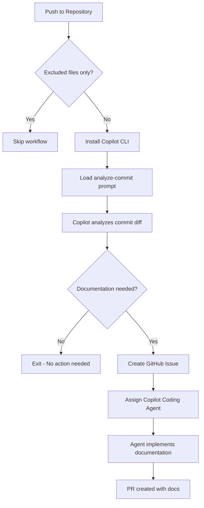

# Generate Documentation Workflow

**Workflow File**: [`.github/workflows/generate-docs.yml`](../../.github/workflows/generate-docs.yml)

## Overview

The Generate Documentation workflow leverages GitHub Copilot CLI to analyze code changes and automatically creates documentation when necessary. Instead of relying on developers to remember to update docs, this agentic workflow handles it autonomously.


## How It Works



### Step-by-Step Process

1. **Triggers on every push** (excluding docs and markdown files)
2. **Installs Copilot CLI** in the GitHub Actions runner
3. **Loads the analyze-for-docs prompt** from [`.github/prompts/analyze-for-docs.prompt.md`](../../.github/prompts/analyze-for-docs.prompt.md)
4. **Copilot examines the commit diff** using MCP tools
5. **If documentation is needed** → Creates a GitHub issue and assigns Copilot
6. **Copilot Coding Agent** then implements the documentation


## Criteria for Documentation

### ✅ Documentation IS Needed

| Change Type | Example |
|-------------|---------|
| Public APIs | New REST endpoints, GraphQL mutations |
| Functions/Classes | Exported functions, public class methods |
| Complex Logic | Algorithms, business rules, data transformations |
| Architectural Changes | New services, modified data flow |
| Breaking Changes | API contract changes, removed features |

### ❌ Documentation NOT Needed

| Change Type | Example |
|-------------|---------|
| Minor Refactoring | Variable renames, code reorganization |
| Formatting | Whitespace, linting fixes |
| Trivial Typo Fixes | Comment typos, string corrections |
| Internal Implementation | Private methods, internal helpers |


## Configuration

### Trigger Configuration

The workflow excludes certain paths to avoid unnecessary runs:

```yaml
on:
  push:
    paths-ignore:
      - 'docs/**'
      - '**/*.md'
      - '.github/workflows/**'
```

### Required Secrets

| Secret | Description |
|--------|-------------|
| `COPILOT_CLI_TOKEN` | Personal Access Token with Copilot permissions |

---

## Prompt File

The workflow uses a specialized prompt to guide Copilot's analysis:

**Location**: [`.github/prompts/analyze-for-docs.prompt.md`](../../.github/prompts/analyze-for-docs.prompt.md)

This prompt instructs Copilot to:
- Analyze the git diff of the latest commit
- Evaluate changes against documentation criteria
- Determine if public-facing code was added or modified
- Create a well-structured issue if documentation is warranted


## Example Issue Created

When the workflow detects documentation is needed, it creates an issue like:

```markdown
## 📚 Documentation Needed

**Commit**: abc1234
**Author**: @developer

### Changes Requiring Documentation

- New `/api/warehouses` endpoint added
- `Warehouse` model with 10 properties
- CRUD operations for warehouse management

### Suggested Documentation

1. Update API documentation with new endpoints
2. Add Warehouse model to data model docs
3. Include usage examples

/assign @copilot
```


## Troubleshooting

### Workflow Not Triggering

- Verify the push includes files outside the `paths-ignore` patterns
- Check that the workflow file exists in the default branch

### Copilot Not Creating Issues

- Ensure `COPILOT_CLI_TOKEN` secret is configured
- Verify the token has `Copilot Requests` permission
- Check workflow logs for authentication errors

### Agent Not Implementing Documentation

- Confirm Copilot Coding Agent is enabled in repository settings
- Verify the issue is properly assigned to `@copilot`
