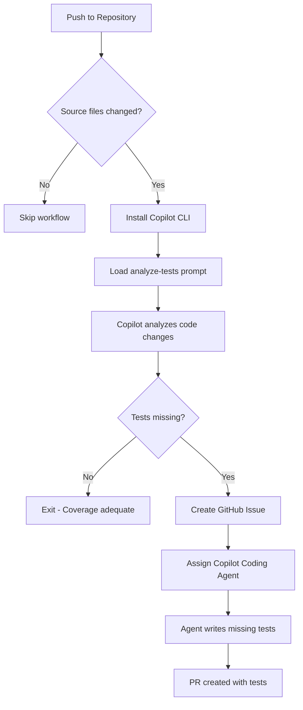

# Generate Tests Workflow

**Workflow File**: [`.github/workflows/generate-tests.yml`](../../.github/workflows/generate-tests.yml)

This workflow analyzes commits for missing unit test coverage and automatically creates issues for Copilot to write the tests.


## Overview

The Generate Tests workflow uses GitHub Copilot CLI to examine code changes and identify when new or modified code lacks corresponding unit tests. By automating test coverage analysis, teams can maintain high code quality without manual review overhead.


## How It Works



### Step-by-Step Process

1. **Triggers on every push** (excluding non-source files)
2. **Installs Copilot CLI** in the GitHub Actions runner
3. **Loads the analyze-for-tests prompt** from [`.github/prompts/analyze-for-tests.prompt.md`](../../.github/prompts/analyze-for-tests.prompt.md)
4. **Copilot checks if new code has corresponding tests**
5. **If tests are missing** → Creates a GitHub issue and assigns Copilot
6. **Copilot Coding Agent** then writes the missing tests


## Criteria for Tests

### ✅ Tests ARE Needed

| Change Type | Example |
|-------------|---------|
| New Functions/Methods | `calculateDiscount()`, `validateOrder()` |
| New Classes | `WarehouseService`, `OrderProcessor` |
| Modified Business Logic | Changed calculation formulas, updated validation |
| New API Endpoints | REST routes, GraphQL resolvers |
| Error Handling Paths | Try/catch blocks, error conditions |

### ❌ Tests NOT Needed

| Change Type | Example |
|-------------|---------|
| Configuration Files | `tsconfig.json`, `package.json` |
| Type Definitions Only | Interface declarations, type aliases |
| Test Files Themselves | `*.test.ts`, `*.spec.ts` |
| Documentation | README, comments, JSDoc |
| Static Assets | Images, fonts, CSS |


## Configuration

### Trigger Configuration

The workflow focuses on source code changes:

```yaml
on:
  push:
    paths:
      - 'api/src/**/*.ts'
      - 'frontend/src/**/*.ts'
      - 'frontend/src/**/*.tsx'
    paths-ignore:
      - '**/*.test.ts'
      - '**/*.spec.ts'
      - '**/*.d.ts'
```

### Required Secrets

| Secret | Description |
|--------|-------------|
| `COPILOT_CLI_TOKEN` | Personal Access Token with Copilot permissions |


## Prompt File

The workflow uses a specialized prompt to guide Copilot's analysis:

**Location**: [`.github/prompts/analyze-for-tests.prompt.md`](../../.github/prompts/analyze-for-tests.prompt.md)

This prompt instructs Copilot to:
- Analyze the git diff for testable code changes
- Identify functions, classes, and methods without test coverage
- Evaluate if existing tests cover the modified code paths
- Create a detailed issue listing specific tests to write


## Example Issue Created

When the workflow detects missing tests, it creates an issue like:

```markdown
## 🧪 Unit Tests Needed

**Commit**: def5678
**Author**: @developer

### Code Requiring Tests

#### `api/src/routes/warehouse.ts`
- [ ] `POST /` - Create warehouse endpoint
- [ ] `GET /` - Get all warehouses
- [ ] `GET /:id` - Get warehouse by ID
- [ ] `GET /branch/:branchId` - Get warehouses by branch
- [ ] `PUT /:id` - Update warehouse
- [ ] `DELETE /:id` - Delete warehouse

### Test File Location
`api/src/routes/warehouse.test.ts`

### Testing Framework
Vitest with supertest for API testing

/assign @copilot
```


## Test Patterns Used

The Copilot Coding Agent follows established testing patterns in the codebase

### API Route Tests

```typescript
import { describe, it, expect, beforeEach } from 'vitest';
import request from 'supertest';
import app from '../index';

describe('Warehouse Routes', () => {
  describe('GET /api/warehouses', () => {
    it('should return all warehouses', async () => {
      const response = await request(app).get('/api/warehouses');
      expect(response.status).toBe(200);
      expect(Array.isArray(response.body)).toBe(true);
    });
  });

  describe('GET /api/warehouses/:id', () => {
    it('should return 404 for non-existent warehouse', async () => {
      const response = await request(app).get('/api/warehouses/99999');
      expect(response.status).toBe(404);
    });
  });
});
```


## Troubleshooting

### Workflow Not Triggering

- Verify the push includes files matching the `paths` patterns
- Ensure changes are not exclusively in `paths-ignore` patterns
- Check that the workflow file exists in the default branch

### Copilot Not Detecting Missing Tests

- Review the generate-tests prompt for coverage criteria
- Ensure the code changes are substantial enough to warrant tests
- Check workflow logs for the analysis output

### Agent Writing Incorrect Tests

- Verify existing test patterns in the codebase are consistent
- Check that the testing framework is correctly configured
- Review the prompt for framework-specific instructions

### Tests Failing After Generation

- Run tests locally to identify issues
- Check for missing imports or dependencies
- Verify mock data matches the expected schema
